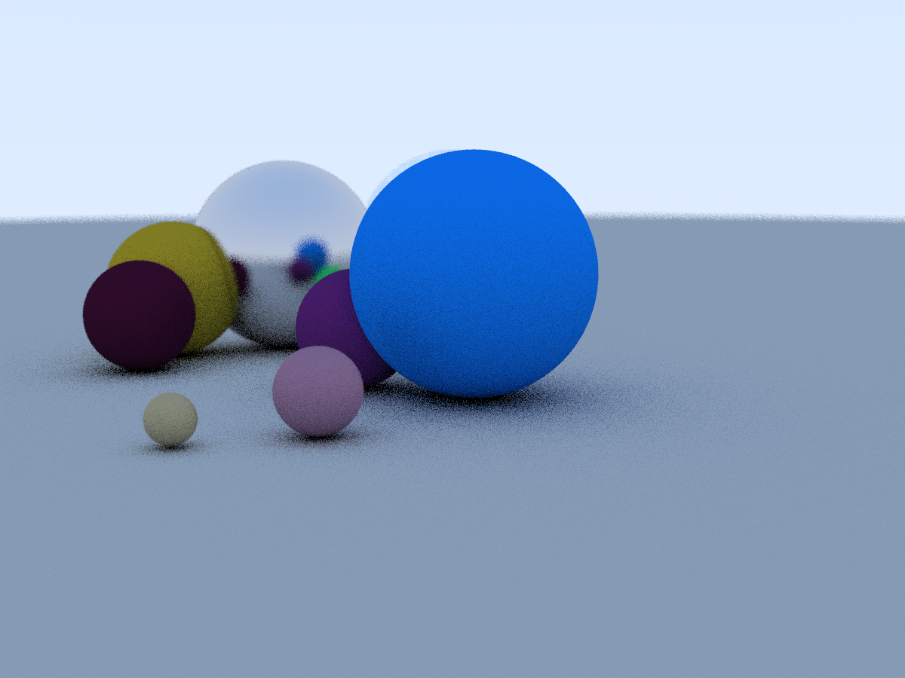
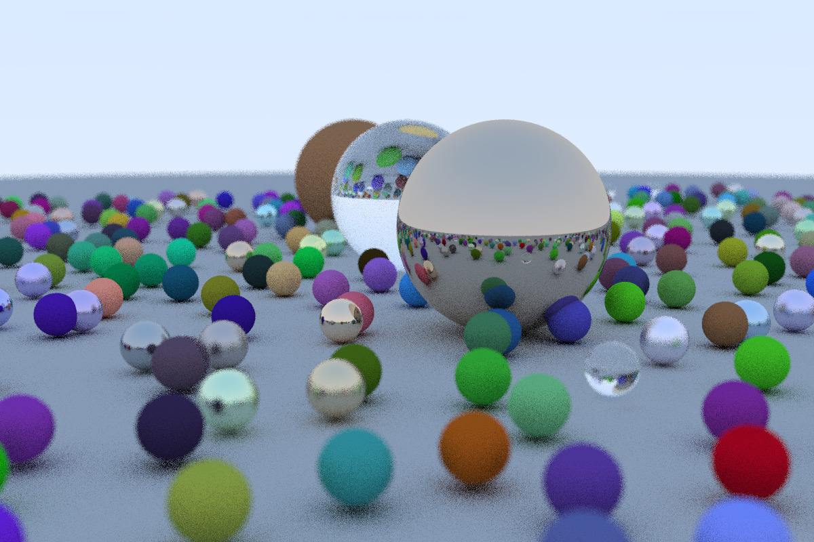

# HPC Ray Tracing
Данное приложение представляет собой реализацию трассировщика лучей (ray tracer), основанного на технологии *CUDA* для параллельных вычислений на графическом процессоре (GPU). Программа формирует изображение сцены, содержащей сферы с различными материалами и освещением. Многие концепции были взяты из указанной книги [Ray Tracing on Weekend](http://in1weekend.blogspot.com/2016/01/ray-tracing-in-one-weekend.html).

## Запуск:
Для работы блокнота на GoogleColab, папку *raytracing* нужно поместить на свой GoogleDisk

## Результаты

## Оценка времени работы
Автор описанной в заглавии [книги](http://in1weekend.blogspot.com/2016/01/ray-tracing-in-one-weekend.html) демонстрирует среднее время выполнения программы около **90 секунд** на чистом *C++*, используя процессоре *Intel Core i7 (6 ядер)*  для создания указанного изображения:

В моей разработке, использующей технологию CUDA для формирования данного изображения, затрачено **0.114216** секунды на вычисления в облачной среде *Google Colab*.
